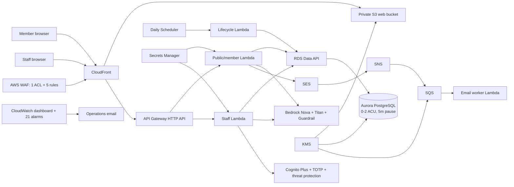

# Cost and scalability design review

Review date: 2026-07-16. Scope: one `us-east-1` production stack plus bootstrap resources, based on repository Terraform rather than a live AWS account.

## Executive summary

- Estimated first-year idle floor: **about $14.90/month** with normal account-wide CloudWatch allocations available, or **about $18.90/month** at list price.
- Estimated total for 500 profiles, 30 volunteer add/update journeys, and 60 staff searches per month: **about $16.15/month**, with a practical planning range of **$16–$18/month**.
- The top fixed-cost offenders are AWS WAF (**$10/month**), two first-year customer-managed KMS keys (**$2/month**), and four Secrets Manager secrets (**$1.60/month**). CloudWatch adds approximately **$1.10/month** after its first ten alarm metrics.
- The database rows and AI calls are not the cost problem at this scale. Workload adds only about $1.25/month, mostly Aurora wake windows and Bedrock reranking.
- Scale-to-zero score: **6.5/10** for the current pay-as-you-go design. An eligible CloudFront flat-rate Free plan could raise it to approximately **8.5/10** by covering the $10 WAF floor, subject to explicit acceptance of its lack of an uptime SLA and plan-management constraints.

## Current architecture

## Scale-to-zero blockers

1. The pay-as-you-go WAF ACL and five rules cost $10/month even with zero requests.
2. Customer-managed KMS keys cost $1/key-month initially. Automatic rotations raise this by $1/key-month for each of the first two retained rotations.
3. Four Secrets Manager secrets cost $1.60/month while stored.
4. Twenty-one CloudWatch alarm metrics exceed the account-wide allowance of ten. The dashboard is free only while the account remains within its three-dashboard allocation.
5. Aurora storage remains billable while compute is paused.
6. The daily lifecycle schedule wakes Aurora for at least the five-minute inactivity period, creating about $0.16/month of compute even with no user traffic.

The system correctly avoids NAT gateways, load balancers, public IPv4 addresses, provisioned Lambda concurrency, VPC endpoints, caches, OpenSearch, and always-running containers.

## Cost ramp

### Step functions

- A second deployed environment nearly doubles application-stack fixed cost. Dev plus prod is approximately $30/month with shared CloudWatch allocations.
- KMS automatic rotation adds about $2/month across the two keys after the first rotation and another $2/month after the second.
- Account-wide exhaustion of CloudWatch's free dashboard, alarm, metric, or log allocations moves the bill toward the $19 list-price idle case.
- CloudFront flat-rate Free eligibility would remove the largest fixed step; the Pro plan costs $15/month and is more expensive than the current $10 WAF floor for this traffic.
- If Aurora stops pausing and remains at 0.5 ACU all month, compute alone becomes about $43.80/month. At 1 ACU it is about $87.60/month. The stated 90 monthly workflows are far below this point.

### Roughly linear costs

- Nova input/output tokens, Titan input tokens, and guardrail text units scale with workflow count and text length.
- Each isolated database activity window adds about $0.005 at 0.5 ACU because the cluster remains active for five minutes.
- SES, API Gateway, Lambda, WAF requests, SQS, SNS, KMS requests, and Aurora I/O remain below pennies or normal free allocations at this workload.
- Search AI cost is bounded by the application cap of 10 candidate profiles. Database retrieval cost grows with data/index size, but 500 vector rows are trivial for Aurora.

### Costs that can grow unexpectedly

- Long profile prose increases every reranker payload across up to 10 candidates. The 6,000-character schema maximum provides a hard bound but is much larger than the intended 100–350-word profile.
- Repeated Bedrock retries or failed grounded outputs still consume tokens.
- Embedded Metric Format treats each unique metric/dimension combination as a separate custom metric. Current dimensions are bounded and non-personal, but adding unbounded dimensions would create a cost/cardinality problem.
- Leaving a dev environment running is a larger cost increase than the entire stated production workload.
- Backup storage can become billable if high write churn causes incremental backup usage to exceed the active cluster's included allowance.

## Scalability bottlenecks

- A first request after auto-pause normally waits for Aurora resume. AWS documents a typical resume around 15 seconds and potentially 30 seconds or longer after deep sleep.
- The staff search performs planner inference, embedding, SQL retrieval, and reranking synchronously inside a 30-second API integration timeout. Reranking 10 long profiles is the most likely latency boundary.
- One writer capped at 2 ACU is appropriate for 500 profiles, but it is the first database throughput ceiling under sustained concurrency.
- Public and staff Lambda reserved concurrency limits protect cost but cap throughput at 20 and 10 respectively.
- Re-embedding uses a batch size of one and concurrency two. This is safe and inexpensive but will produce queue lag during a large model migration.
- Data API avoids connection storms. No NAT or Lambda VPC attachment exists, which is favorable for both cost and scaling.

## Recommendations

### P0 — evaluate the CloudFront flat-rate Free plan

- What: In a paid AWS account, test associating the existing distribution and its five-rule WAF ACL with the $0/month flat-rate Free plan.
- Why: AWS states that the plan covers the distribution, associated WAF ACL, managed/custom rules, and WAF requests. This removes the $10/month top offender while retaining five rules.
- Expected impact: idle falls from about $14.90 to about $4.90/month; stated-workload total falls from about $16.15 to about $6.15/month.
- Risks/tradeoffs: no uptime SLA on Free or Pro, account/history eligibility, console-oriented enrollment, and potential incompatibility between plan-controlled behavior and Terraform ownership. Do not change production until a dev proof and rollback test succeed.
- Action: migration plan and rollout runbook only; do not enroll automatically.

### P0 — do not keep dev deployed continuously

- What: Create dev for a test window and destroy it afterward, preserving only remote state.
- Why: an idle dev stack costs roughly another $15/month, nearly ten times the stated production workload increment.
- Expected impact: avoids approximately $13–$18/month depending on shared free allocations and key age.
- Risks/tradeoffs: recreation time, fresh Aurora cold start, and loss of ephemeral dev data. Never use dev as a backup or record system.
- Action: operational policy; no live change was performed.

### P0 — calibrate with billed metrics after the first full month

- What: Compare Cost Explorer/CUR line items with `ServerlessV2Usage`, Bedrock token EMF metrics, distinct Cognito MAUs, and WAF charges.
- Why: Aurora active duration and profile/reranker text length are the primary estimate uncertainties.
- Expected impact: improves forecast accuracy; no direct service-cost reduction.
- Risks/tradeoffs: requires read-only billing permissions and tag activation.
- Action: use `RUNBOOK_ROLLOUT.md`.

### P1 — lower the production budget threshold after baseline confirmation

- What: Reduce the current $300 monthly budget to approximately $50 after a full clean billing month.
- Why: a $300 threshold would detect a major regression late relative to a $16–$18 expected bill.
- Expected impact: governance only; earlier warning for an unpaused database, extra environment, or WAF/Bedrock abuse.
- Risks/tradeoffs: false alerts if the account aggregates unrelated costs or if deployment is intentionally scaled.
- Action: plan only until account scope is known.

### P1 — preserve bounded observability dimensions

- What: Keep EMF dimensions limited to environment, service, and a fixed route/operation set; add a repository check if new metrics are introduced.
- Why: prevents accidental high-cardinality custom metric charges.
- Expected impact: keeps custom metrics within or near free allocations at this volume.
- Risks/tradeoffs: less flexible ad hoc slicing; detailed investigation stays in sanitized logs.
- Action: current code already follows this design; no runtime change required.

### P2 — consider a different data store only if requirements change

- What: Do not replace Aurora merely to save the roughly $0.9/month database cost at this workload. Revisit only if eliminating cold starts matters more than PostgreSQL full-text/pgvector semantics.
- Why: DynamoDB/S3 alternatives could reduce idle cost but require rebuilding hybrid retrieval, transactional approval, lifecycle, and audit behavior.
- Expected impact: at most about $1/month now, excluding engineering and migration cost.
- Risks/tradeoffs: high correctness and search-quality risk.
- Action: no implementation recommended.

## Validation status

- Repository inventory is recorded in `inventory.yaml`.
- Pricing formulas and sensitivities are recorded in `cost_model.md`.
- No AWS resources were queried, changed, applied, or destroyed.
- No production Terraform behavior was changed as part of this estimate.
