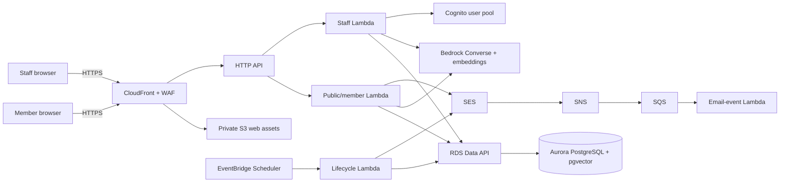
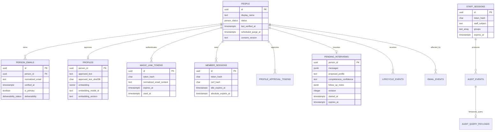

# Architecture

Gifts in Service is a same-origin React application behind CloudFront. Public/member requests and staff requests are routed to separate Lambda integrations and authorization gates. Aurora PostgreSQL is accessed through the RDS Data API, so application functions have no database network path. The approved profile prose is the only skills system of record.

## Trust boundaries and data flow

- The public/member Lambda stores one person-scoped pending transcript, completeness state, and bounded unanswered-thread notes in encrypted Aurora for a fixed 30 days. The server supplies that authoritative state to stateless model calls. It is deleted on approval, expiry, or person purge and is never exposed to staff search.
- API Gateway, WAF, CloudFront, Lambda logs, traces, and application logs are configured or coded without request/response bodies. Production is blocked until an operator independently confirms Bedrock retention and invocation-logging posture.
- A profile draft remains transient until the member approves the exact text. Approval is bound to a short-lived server-side token and SHA-256 hash; the embedding is made from that exact text only.
- Magic links place 256-bit opaque material in the URL fragment. Only keyed hashes are stored. Redemption is a POST and rotates to an opaque, hashed member session with CSRF and Origin checks. Member sessions have a fixed 30-day absolute lifetime that activity does not extend.
- Staff enter Cognito credentials and TOTP codes in the `/staff` application page. The same-origin staff Lambda performs Cognito's server-side password/challenge flow, keeps the confidential app-client secret off the browser, verifies the final ID token and exact group claims, then discards that token and issues a separate opaque staff session. Cognito challenge state is carried only in a short-lived authenticated-encrypted browser transaction.
- Staff search combines PostgreSQL full-text, pgvector cosine, and trigram candidate lists using reciprocal-rank fusion. Bedrock may rerank only those approved texts; deterministic evidence validation rejects unsupported reasons.
- CloudFront adds an origin-verification header. Production Lambdas reject direct API Gateway requests without it.

## Deployment and failure shape

Aurora Serverless v2 defaults to 0–2 ACU with auto-pause. The Data API absorbs connection management but the first request after pause can be slower. Lambda concurrency is deliberately capped. Email events and re-embedding use encrypted queues with dead-letter queues and partial-batch failure reporting. Lifecycle work is date-derived and idempotent.

The static site has no third-party scripts, fonts, pixels, or analytics. CloudFront supplies CSP, no-referrer, HSTS, framing, MIME-sniffing, and permissions headers. API responses and authentication pages are non-cacheable.

## Database relationships

Material choices are recorded in [ADR 0001](adr/0001-approved-prose-and-stateless-interviews.md), [ADR 0002](adr/0002-serverless-data-api-and-hybrid-search.md), [ADR 0003](adr/0003-separate-opaque-sessions.md), [ADR 0004](adr/0004-resumable-pending-interviews.md), and [ADR 0005](adr/0005-in-page-cognito-staff-auth.md). ADR 0004 supersedes ADR 0001's stateless-interview decision, and ADR 0005 supersedes ADR 0003's hosted authorization-code details.
